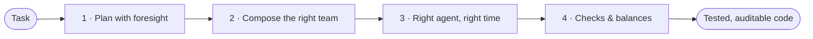

# Architecture

This page explains *why* Agent Baton is built the way it is. For component-level structure see [`architecture/high-level-design.md`](architecture/high-level-design.md). For internals (state machine, planner, executor, dispatcher, gates, persistence) see [`architecture/technical-design.md`](architecture/technical-design.md). For the package map with `path:line` cites see [`architecture/package-layout.md`](architecture/package-layout.md). For the action enum and transitions see [`architecture/state-machine.md`](architecture/state-machine.md).

!!! abstract "Pillar context"
    This overview covers the engine behind all four pillars. For the high-level map of what Baton is *for*, see [The Four Pillars](pillars.md).

## How this maps to the four pillars

Baton is a project manager for Claude Code. Every architectural decision below serves one of four pillars:

- **Pillar 1 — Plan with foresight.** The planner, risk classifier, and spec federation pipeline turn a natural-language task into a structured, risk-tiered, budget-aware plan before a single agent runs.
- **Pillar 2 — Compose the right team.** The agent registry, talent-builder, and dispatcher match each phase to the specialist best suited for it, keeping context scoped and fresh.
- **Pillar 3 — Right agent, right problem, right time.** The execution engine, PMO UI, and orchestration loop sequence agents, manage state, and recover from crashes without losing progress.
- **Pillar 4 — Checks & balances.** Gates, assurance packs, the auditor agent, and compliance audit trails enforce correctness and auditability at every phase boundary.



This overview is the engine story. For the what-and-why of each pillar, see [The Four Pillars](pillars.md).

## What problem Baton solves

Long Claude Code sessions on cross-cutting tasks tend to: lose context between subtasks, miss test coverage because gating depends on the operator remembering, leave no audit trail, and have no way to recover when the session crashes. Baton adds a project management layer that breaks work into phases, scopes each phase to one specialist agent, enforces automated gates, and persists state so a crashed session resumes cleanly.

The engine does **not** replace Claude. It serves Claude. All judgment and natural-language work stays with the model; the engine owns sequencing, persistence, gates, traces, and learning.

## Design philosophy

1. **Separation of concerns.** Claude owns intelligence (deciding what to do, generating code, reading natural language). The engine owns bookkeeping (state persistence, event tracking, plan sequencing, gate enforcement). Neither trespasses on the other's domain. The interface is the CLI.

2. **Crash recovery by default.** Every state mutation is persisted to disk before the next action is returned. A Claude Code session can be killed mid-execution; `baton execute resume` reconstructs state from the last checkpoint and continues. There is no "in-memory plan" to lose.

3. **Protocol-driven contracts.** The engine exposes formally defined protocols — `ExecutionDriver` (15 methods, in `agent_baton/core/engine/protocols.py`) for runtime consumers and `StorageBackend` for persistence backends. Tests inject lightweight protocol-conforming objects without subclassing concrete implementations.

4. **Layered dependency order.** A strict import hierarchy: `models` → `core subsystems` → `CLI/API`. No circular imports. Each layer depends only on layers below it. Cymbal-investigate any new symbol before adding it to confirm placement.

5. **Graceful degradation.** Historical data (patterns, budget tuning, retrospectives) enriches plans when present. When no prior data exists, the planner falls back to sensible defaults. No subsystem gates execution on the availability of another.

#### Executable Beads (Wave 6.1 Part C, bd-81b9)

`agent_baton/core/exec/` ties together storage and execution of `ExecutableBead` (subtype of `Bead` with `bead_type="executable"`, `script_sha`, `script_ref`, `interpreter`, `runtime_limits`). The pipeline is: `ScriptLinter` (denylist of dangerous patterns) → optional soul signature when `BATON_SOULS_ENABLED=1` → `BdBeadStore.write()` (via `bead_backend.make_bead_store()`) with `status="quarantine"` → `AuditorGate.approve(bead_id)` flips status to `open` → `ExecutableBeadRunner.run()` resolves the script body from the bead's inline `script_body` (stored in the bd metadata blob; verified against `script_sha`), executes it through `Sandbox`, and writes a child `discovery` bead linked to the parent via `validates` (exit 0) or `contradicts` (non-zero). Whole subsystem is gated behind `BATON_EXEC_BEADS_ENABLED=1`. CLI surface: `baton beads create-exec` (quarantine on insert) and `baton beads exec` (operator confirmation + auditor gate + sandbox run).

##### Trust Boundary

The sandbox provides **process-level isolation only** — wall-clock timeout, memory limit, captured stdout/stderr — plus a static lint denylist and an operator-confirmation prompt. It does NOT provide filesystem namespacing, network namespacing, or a syscall filter. The trust model assumes scripts are locally-authored, version-controlled, and reviewed by the team running `baton`. The threat model in scope is **accidents and broken builds**, not supply-chain attacks or malicious actors.

Beads from external origins (federation, downloaded packs, fork PRs, customer uploads) are NOT covered by the current sandbox. `baton beads exec` emits a one-line `[security]` warning when it detects a non-local `source` value to surface the gap; the warning is a tripwire, not a defence. If the executable-bead surface is ever extended to consume untrusted input, the sandbox must be upgraded to namespacing + seccomp **before** that use case ships.

Single source of truth for the rules above: [baton-patterns: Executable Beads — Trust Boundary](references/baton-patterns.md)

## The three load-bearing invariants

These are documented in detail in [`invariants.md`](invariants.md). In summary:

1. **Engine owns persistence; Claude owns intelligence.** The CLI is the boundary.
2. **Every action is replayable.** State is durable, idempotent, ordered.
3. **Risk classification gates the plan.** Tier (LOW / MEDIUM / HIGH / REGULATED) drives required reviewers, mandatory gates, and approval flow.

Anything that violates one of these is a bug.

## How a task flows through the system

```
User describes task
        │
        ▼
   baton plan ─────────► Risk classifier ─────► Knowledge resolver
        │                       │                       │
        ▼                       ▼                       ▼
   plan.json + plan.md   guardrail preset       reference packs
        │
        ▼
   baton execute start
        │
        ▼
   ┌─── Action loop (until COMPLETE) ───┐
   │                                    │
   │  next_action() ─► DISPATCH         │
   │                   │                │
   │                   ▼                │
   │       Orchestrator spawns agent    │
   │                   │                │
   │                   ▼                │
   │       record_step_result()         │
   │                                    │
   │  next_action() ─► GATE             │
   │                   │                │
   │                   ▼                │
   │       Run pytest/lint/etc          │
   │                   │                │
   │                   ▼                │
   │       record_gate_result()         │
   │                                    │
   │  next_action() ─► APPROVAL         │
   │                   │                │
   │                   ▼                │
   │       Wait for sign-off            │
   │                                    │
   └────────────────────────────────────┘
        │
        ▼
   baton execute complete ──► trace + retro + scores
        │
        ▼
   Learning loop folds outcomes back into routing/budgets
```

For the precise protocol contract between Claude and the CLI (the `_print_action()` shape, exit codes, environment variables) see [`references/baton-engine.md`](../references/baton-engine.md).

## The three interfaces

Baton exposes three surfaces to the outside world:

- **CLI** (`baton ...`) — the primary interface. Drives planning, execution, observation, governance, learning, distribution. See [`cli-reference.md`](cli-reference.md).
- **REST API** (FastAPI, optional) — exposes the same operations over HTTP for the PMO UI and external integrations. See [`api-reference.md`](api-reference.md).
- **PMO frontend** (React/Vite) — visualizes plans, executions, traces, retros, scores across projects. Served at `/pmo/`.

The engine itself is the same Python package behind all three; the surfaces are thin wrappers.

## Subsystem map

The following pages explain individual subsystems in depth:

- [`engine-and-runtime.md`](engine-and-runtime.md) — planner, executor, dispatcher, gate enforcement, INTERACT primitive
- [`governance-knowledge-and-events.md`](governance-knowledge-and-events.md) — risk classifier, policy engine, knowledge resolver, event bus
- [`observe-learn-and-improve.md`](observe-learn-and-improve.md) — tracing, telemetry, scoring, evolution proposals, learning automation
- [`storage-sync-and-pmo.md`](storage-sync-and-pmo.md) — SQLite layout, federated sync, PMO store, Smart Forge
- [`finops-chargeback.md`](finops-chargeback.md) — token/cost attribution model
- [`design-decisions.md`](design-decisions.md) — ADR log: every decision and what it superseded
- [`daemon-mode-evaluation.md`](daemon-mode-evaluation.md) — historical evaluation of the daemon-mode design

## Assurance Packs

Assurance Packs are how the checks-and-balances layer (the README's Pillar 4)
is packaged for regulated domains. They are org-authored domain governance units
stored under `.claude/packs/<name>/`.  A pack bundles a `PolicySet`, classification signals,
a review rubric, gate commands, and evidence requirements into a single
distributable directory.  Organisations author packs for each regulated domain
they operate in (HIPAA, OWASP, SOC 2, GDPR, …) and the pack format ships with
baton.  At startup, `load_packs()` scans `.claude/packs/`, validates each entry,
and `register_pack_policies()` installs the pack's `PolicySet` into the in-process
registry under the key `"pack:<name>"`.  The risk classifier is extended via
`make_classifier_for_packs()` so that pack-specific keywords and path patterns
elevate risk and set the guardrail preset to `"pack:<name>"` — which
`baton policy-check` then enforces as a PreToolUse hook.  Use `baton packs init`,
`baton packs validate`, and `baton packs list` to author and manage packs.
Template packs for HIPAA PHI and OWASP secure coding ship under `templates/packs/`.

## Why "phases"?

A phase is a named, gated segment of a plan. The phase shape is load-bearing because:

- It bounds context. Each phase has its own set of files and concerns; the dispatched agent reads only what its phase needs.
- It bounds risk. The classifier assigns a tier per phase; HIGH-risk phases require approval before any agent runs.
- It bounds cost. Each phase has a budget tier (`tight` / `standard` / `generous`) and the run-level `BATON_RUN_TOKEN_CEILING` hard-stops the loop on overruns.
- It bounds rollback. If a phase fails, only that phase's commits need to be reverted — earlier phases remain.
- It composes. Phases can run sequentially or in parallel (when their concerns are disjoint).

Steps within a phase are smaller units: a DISPATCH (one agent), a GATE (one check), or an INTERACT (one dialogue).

## Team execution: pluggable backend

A team step (`step.team` non-empty) is dispatched through a `TeamBackend` strategy selected by `BATON_TEAMS_BACKEND`. Both backends are **supported**; they trade off different properties, so pick per task:

- **`worktree`** (default) — parallel dispatch under git worktree isolation. Fully resumable via `baton execute resume`, preserves nested teams, and honors full agent frontmatter (`skills`/`mcpServers`).
- **`claude-teams`** (opt-in) — writes a spawn-prompt artifact directing an outer Claude Code session to create a native Agent Team via `CLAUDE_CODE_EXPERIMENTAL_AGENT_TEAMS`. Wins on native Agent Teams UX (inter-teammate messaging, shared task list, lead plan-approval). Carries Anthropic-side constraints (no in-process resume, one team at a time, no nested teams, `skills`/`mcpServers` frontmatter not honored on teammates); the spawn prompt degrades loudly on each, and the planner emits a warning when these constraints conflict with the chosen plan shape.

In both backends, a per-team mailbox at `.claude/team-context/mailbox/team-{step_id}.jsonl` captures Agent Teams' hook taxonomy (`task_created`, `task_completed`, `task_failed`, `teammate_idle`, `plan_approval_*`). The mailbox is JSONL, append-only, retained past team teardown for audit. See [`engine-and-runtime.md`](engine-and-runtime.md) §18 and ADR-24 in [`design-decisions.md`](design-decisions.md).

## Why a planner separate from execution?

Planning is fundamentally different work from execution. The planner reasons about scope, risk, and resource allocation; the executor runs a fixed sequence. Separating them lets us:

- Replan without re-executing. `baton execute amend-plan` can adjust phases mid-execution without losing state.
- Use different models for each. The planner is a deterministic governance-enrichment pass (classification → preset → reviewers → gates → budget) with no LLM calls by default; `BATON_PLAN_REVIEW=haiku|sonnet|opus` enables an optional post-pipeline quality review. Executor steps default to sonnet for backend/frontend work and haiku for triage; decomposition quality is owned by Claude Code plan mode.
- Inspect the plan before paying for execution. `baton plan ... --explain` shows the reasoning; `--save` persists it for later.

The Smart Forge subsystem can dispatch the planner's reasoning to a headless Claude Code subprocess when richer plan synthesis is needed; see [`storage-sync-and-pmo.md`](storage-sync-and-pmo.md).

## Spec Federation pipeline (007 Phase I)

The Spec Federation subsystem (`agent_baton/core/federate/`) introduces a
structured pipeline for converting natural-language specifications into agent
plans without requiring the submitter to understand the planner internals.

**Pipeline:** submit → enrich → review → fire

1. **Submit** — a team member posts a `title` + `body` (or imports from GitHub
   Issues / Azure DevOps via `POST /api/v1/pmo/specs/import`). The spec lands in
   `submitted` status and background enrichment is dispatched.

2. **Enrich** (`agent_baton/core/federate/enrich.py`) — `DataClassifier` (with
   pack-aware overrides) assigns a risk level and guardrail preset. `PolicyEngine`
   derives required reviewers from `require_agent` rules. `cost_estimator` or
   history-calibrated `CostForecaster` produces a USD estimate range and
   per-agent breakdown. The spec transitions to `enriched`.

3. **Review** — an architect calls `POST .../approve` or `POST .../bounce`.
   In `BATON_APPROVAL_MODE=team` mode a reviewer may not approve their own spec.
   Bounced specs carry required feedback and return to `submitted` for revision.

4. **Fire** (`POST .../fire`) — an approved spec is dispatched via `ForgeSession`
   with the target `project_id`. The resulting `task_id` is stored on the spec
   and status becomes `fired`.

All spec drafts are persisted in `spec_drafts` table (schema migration 45,
`agent_baton/core/federate/spec_draft_store.py`). The table lives in the central
DB; `BATON_SPEC_DRAFT_DB` overrides the path for test isolation. The PMO UI
exposes the full pipeline via the **Spec Queue** tab (`SpecQueuePanel.tsx`).

## Why federated SQLite?

Each project owns its `baton.db`. A central database (`~/.config/agent-baton/central.db`) federates project data for cross-project views in the PMO UI. The split exists because:

- A project should remain useful when its central DB is unavailable.
- A central DB is convenient for cross-project search, scoring, learning rollups, but contains nothing a project itself relies on.
- Sync is bidirectional and idempotent; either side can be rebuilt from the other.

Treat the per-project DB as primary. Never query `project_id` from a per-project DB — that column lives only in `central.db`.

## Why a learning loop?

After every execution, the engine writes a trace, usage log, and retrospective. The `learning-analyst` agent reads these and proposes config improvements. The `system-maintainer` agent reads escalated proposals and conservatively applies safe changes to `learned-overrides.json` (never source code). Over time the routing, budget, and gating defaults converge toward what works on this codebase.

The learning loop feeds execution outcomes back into planning defaults. It is operational for routing corrections and budget tuning; agent-driven analysis is still maturing and is not yet validated against real-world usage data. For current per-component status see [`observe-learn-and-improve.md`](observe-learn-and-improve.md) §2.5.

## Where to read next

- For *what's where* in the codebase: [`architecture/package-layout.md`](architecture/package-layout.md).
- For *how the state machine actually transitions*: [`architecture/state-machine.md`](architecture/state-machine.md).
- For *why specific calls were made*: [`design-decisions.md`](design-decisions.md).
- For *how to use Baton on a real task*: [`examples/first-run.md`](examples/first-run.md) (tutorial) or [`orchestrator-usage.md`](orchestrator-usage.md) (recipes).
