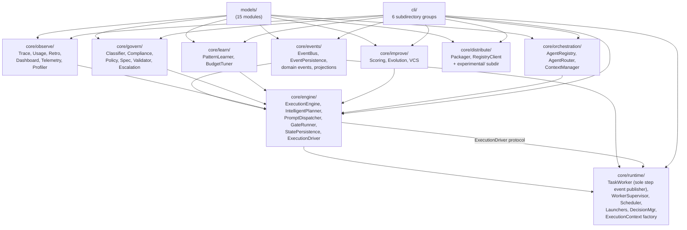

# Agent-Baton Architecture

## 1. Overview

Agent-baton is a multi-agent orchestration engine for Claude Code. It does not
replace Claude — it serves it. The Python package implements a state machine
that plans, sequences, and tracks subagent execution. Claude reads the
orchestrator agent definition as part of its context, calls the `baton` CLI to
drive execution, and parses the CLI's structured output to decide what to do
next. All user-facing intelligence lives in the agent definitions; all
execution bookkeeping lives in the Python engine.

---

## 2. Interaction Chain

```
Human User  <-->  Claude Code  <-->  baton CLI  <-->  Python engine
             Layer A            Layer B            Layer C           Layer D
          (natural language) (structured text) (subprocess I/O) (state machine)
```

| Layer | Responsibility | Technology |
|-------|---------------|------------|
| A | Human intent | Natural language |
| B | Orchestration decisions | Claude reads agent definitions, parses CLI output |
| C | Control protocol | `baton` CLI commands, stdout structured text |
| D | Execution bookkeeping | Python package (`agent_baton`) |

Claude never imports the Python package directly. It reads text output from
`baton` commands and acts on it. This separation is load-bearing: the CLI
output format and command surface are the only contracts Claude depends on.

---

## 3. Package Layout

```
agent_baton/
  __init__.py         exports: ExecutionEngine, TaskWorker, MachinePlan,
  |                            AgentRegistry, AgentRouter, ContextManager,
  |                            IntelligentPlanner, AgentLauncher, DryRunLauncher
  models/             Foundation layer. No internal deps.
  |  execution.py     MachinePlan, PlanPhase, PlanStep, PlanGate,
  |                   ExecutionState, StepResult, GateResult,
  |                   ExecutionAction, ActionType, StepStatus, PhaseStatus
  |  enums.py         RiskLevel, TrustLevel, BudgetTier, ExecutionMode,
  |                   GateOutcome, FailureClass, GitStrategy, AgentCategory
  |  events.py        Event model types
  |  mission_log.py   MissionLogEntry
  |  decision.py      DecisionRecord
  |  ... (10 other model modules)
  utils/
  core/
  |  __init__.py      3 canonical re-exports: AgentRegistry, AgentRouter,
  |                   ContextManager
  |
  |  orchestration/   AgentRegistry, AgentRouter, ContextManager
  |  govern/          DataClassifier, ComplianceReportGenerator, PolicyEngine,
  |  |                SpecValidator, AgentValidator, EscalationManager
  |  observe/         TraceRecorder, UsageLogger, RetrospectiveEngine,
  |  |                DashboardGenerator, AgentTelemetry, ContextProfiler
  |  improve/         PerformanceScorer, PromptEvolutionEngine, AgentVersionControl
  |  learn/           PatternLearner, BudgetTuner
  |  distribute/      PackageBuilder, RegistryClient (production)
  |  |  experimental/ AsyncDispatcher, IncidentManager, ProjectTransfer
  |  events/          EventBus, EventPersistence, domain events, projections
  |  engine/          ExecutionEngine, IntelligentPlanner, PromptDispatcher,
  |  |                GateRunner, StatePersistence, ExecutionDriver protocol
  |  runtime/         TaskWorker, WorkerSupervisor, StepScheduler,
  |                   AgentLauncher, ClaudeCodeLauncher, DecisionManager,
  |                   ExecutionContext factory
  cli/
     main.py          auto-discovers commands from commands/ subdirectories
     commands/
       execution/     execute.py, plan_cmd.py, status.py, daemon.py,
                      async_cmd.py, decide.py
       observe/       dashboard.py, trace.py, usage.py, telemetry.py,
                      context_profile.py, retro.py
       govern/        classify.py, compliance.py, policy.py, escalations.py,
                      validate.py, spec_check.py, detect.py
       improve/       scores.py, evolve.py, patterns.py, budget.py,
                      changelog.py
       distribute/    package.py, publish.py, pull.py, verify_package.py,
                      install.py, transfer.py
       agents/        agents.py, route.py, events.py, incident.py
```

---

## 4. Dependency Graph

The package uses a strict layered dependency order. No circular imports exist.



Dependency order (no circular imports):
```
models  -->  events, observe, govern, learn, improve, distribute, orchestration
         -->  engine  -->  runtime  -->  CLI
```

---

## 5. Core vs Peripheral Sub-packages

| Category | Sub-packages | Role |
|----------|-------------|------|
| Execution core | `engine`, `runtime`, `orchestration`, `events` | Primary path. Always active during execution. |
| Peripheral — observability | `observe` | Trace, usage, dashboard, telemetry, retrospective |
| Peripheral — governance | `govern` | Classification, compliance, policy, escalation |
| Peripheral — improvement | `improve`, `learn` | Scoring, evolution, pattern learning, budget tuning |
| Peripheral — distribution | `distribute` | Packaging, registry, cross-project transfer |

The execution core forms a dependency chain: `orchestration` produces plans;
`engine` drives the state machine against them; `runtime` wraps the engine in an
async worker and manages launcher processes; `events` carries observability
signals between layers.

Peripheral sub-packages depend on `models` and are consumed by the CLI and the
engine's observability wiring, but they do not affect the execution state machine.

---

## 6. Key Contracts

### 6.1 ExecutionDriver Protocol

`core/engine/protocols.py` defines a `typing.Protocol` (`runtime_checkable`)
that formalizes the interface `TaskWorker` and `WorkerSupervisor` use when
calling the execution engine.

```python
class ExecutionDriver(Protocol):
    def start(self, plan: MachinePlan) -> ExecutionAction: ...
    def next_action(self) -> ExecutionAction: ...
    def next_actions(self) -> list[ExecutionAction]: ...
    def mark_dispatched(self, step_id: str, agent_name: str) -> None: ...
    def record_step_result(self, step_id, agent_name, status, ...) -> None: ...
    def record_gate_result(self, phase_id, passed, output) -> None: ...
    def complete(self) -> str: ...
    def status(self) -> dict: ...
    def resume(self) -> ExecutionAction: ...
    def recover_dispatched_steps(self) -> int: ...
```

`TaskWorker.__init__` accepts `engine: ExecutionDriver`, not the concrete
`ExecutionEngine`. Tests can inject lightweight protocol-conforming objects
without subclassing.

### 6.2 EventBus Ownership

Event topic ownership is divided between the engine and the worker:

| Owner | Topics |
|-------|--------|
| `ExecutionEngine` | `task.started`, `task.completed`, `phase.started`, `phase.completed`, `gate.passed`, `gate.failed` |
| `TaskWorker` | `step.dispatched`, `step.completed`, `step.failed` |

Each step transition produces exactly one event. `EventPersistence` writes all
events to a JSONL file via a bus subscription wired by `ExecutionContext.build()`.

### 6.3 ExecutionContext Factory

`core/runtime/context.py` provides an `ExecutionContext` factory with a
`build(events_dir, *, persist=True)` classmethod. It creates and wires an
`EventBus` together with an optional `EventPersistence` subscriber. Pass the
resulting context to `ExecutionEngine` to avoid ad-hoc bus wiring in callers.

### 6.4 _print_action() Output Format

`cli/commands/execute.py` contains `_print_action()`, which produces the
structured text that Claude parses after every `baton execute next` call:

```
ACTION: DISPATCH
  Agent: backend-engineer--python
  Model: sonnet
  Step:  1.1
  Message: ...
--- Delegation Prompt ---
...
--- End Prompt ---
```

This function is treated as a public API. The field labels, uppercase action
type values, and section delimiters are part of the Claude-baton protocol.
A docstring on the function states this explicitly.

---

## 7. Data Models

The `models/` layer is the foundation. It has no imports from `core/`.

| Module | Key types |
|--------|-----------|
| `execution.py` | `MachinePlan`, `PlanPhase`, `PlanStep`, `PlanGate`, `ExecutionState`, `StepResult`, `GateResult`, `ExecutionAction`, `ActionType`, `StepStatus`, `PhaseStatus` |
| `enums.py` | `RiskLevel`, `TrustLevel`, `BudgetTier`, `ExecutionMode`, `GateOutcome`, `FailureClass`, `GitStrategy`, `AgentCategory` |
| `mission_log.py` | `MissionLogEntry` — records per-step mission log entries |
| `events.py` | Domain event types (published to `EventBus`) |
| `decision.py` | `DecisionRecord` — structured decision log entries |

`MachinePlan` is the canonical plan type. It is the only plan model in the
system and is used by the engine, the runtime, the CLI, and all tests.
`MachinePlan.to_dict()` / `from_dict()` provide JSON serialization for
disk persistence.

Enum fields in dataclasses use typed enum instances internally and serialize
to `.value` strings only at the `to_dict()` boundary.

---

## 8. CLI Structure

`cli/main.py` uses `pkgutil.iter_modules` to auto-discover command modules.
Discovery scans both the flat `commands/` directory and one level of
subdirectories:

```python
for subdir in commands_pkg.__path__:
    for info in pkgutil.iter_modules([subdir]):
        # register command
    for group in Path(subdir).iterdir():
        if group.is_dir() and not group.name.startswith("_"):
            for info in pkgutil.iter_modules([str(group)]):
                # register command
```

Each command module calls `register(subparsers)` to bind its subcommand name.
The subcommand string (e.g. `execute`, `plan`, `dashboard`) is set inside
the module, not derived from the filename, so command files can be reorganized
without changing the `baton` command surface.

### Command Groups

| Group | Directory | Commands |
|-------|-----------|----------|
| Execution | `execution/` | execute, plan, status, daemon, async, decide |
| Observability | `observe/` | dashboard, trace, usage, telemetry, context-profile, retro |
| Governance | `govern/` | classify, compliance, policy, escalations, validate, spec-check, detect |
| Improvement | `improve/` | scores, evolve, patterns, budget, changelog |
| Distribution | `distribute/` | package, publish, pull, verify-package, install, transfer |
| Agents | `agents/` | agents, route, events, incident |
