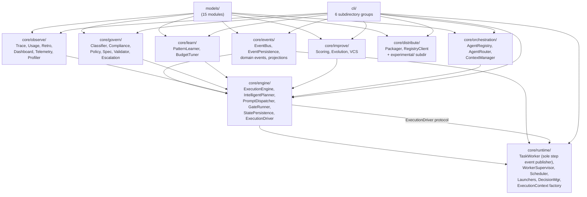

# Agent-Baton Architecture

## 1. Overview

Agent-baton is a multi-agent orchestration engine for Claude Code. It does not
replace Claude — it serves it. The Python package implements a state machine
that plans, sequences, and tracks subagent execution. Claude reads the
orchestrator agent definition as part of its context, calls the `baton` CLI to
drive execution, and parses the CLI's structured output to decide what to do
next. All user-facing intelligence lives in the agent definitions; all
execution bookkeeping lives in the Python engine.

---

## Quick Navigation

| Question | Section |
|----------|---------|
| How does Claude talk to the engine? | [2. Interaction Chain](#2-interaction-chain) |
| What's in each package? | [3. Package Layout](#3-package-layout) |
| What depends on what? | [4. Dependency Graph](#4-dependency-graph) |
| Where is the execution state machine? | [6. Key Contracts](#6-key-contracts) |
| What are the interface contracts? | [6. Key Contracts](#6-key-contracts) |
| How does knowledge delivery work? | [9. Knowledge Delivery](#9-knowledge-delivery-subsystem) |
| How does cross-project sync work? | [10. Federated Sync](#10-federated-sync-architecture) |

---

## 2. Interaction Chain

```
Human User  <-->  Claude Code  <-->  baton CLI  <-->  Python engine
             Layer A            Layer B            Layer C           Layer D
          (natural language) (structured text) (subprocess I/O) (state machine)
```

| Layer | Responsibility | Technology |
|-------|---------------|------------|
| A | Human intent | Natural language |
| B | Orchestration decisions | Claude reads agent definitions, parses CLI output |
| C | Control protocol | `baton` CLI commands, stdout structured text |
| D | Execution bookkeeping | Python package (`agent_baton`) |

Claude never imports the Python package directly. It reads text output from
`baton` commands and acts on it. This separation is load-bearing: the CLI
output format and command surface are the only contracts Claude depends on.

---

## 3. Package Layout

```
agent_baton/
  __init__.py         exports: ExecutionEngine, TaskWorker, MachinePlan,
  |                            AgentRegistry, AgentRouter, ContextManager,
  |                            IntelligentPlanner, AgentLauncher, DryRunLauncher
  models/             Foundation layer. No internal deps.
  |  execution.py     MachinePlan, PlanPhase, PlanStep, PlanGate,
  |                   ExecutionState, StepResult, GateResult,
  |                   ExecutionAction, ActionType, StepStatus, PhaseStatus
  |  enums.py         RiskLevel, TrustLevel, BudgetTier, ExecutionMode,
  |                   GateOutcome, FailureClass, GitStrategy, AgentCategory
  |  events.py        Event model types
  |  mission_log.py   MissionLogEntry
  |  decision.py      DecisionRecord
  |  ... (10 other model modules)
  utils/
  core/
  |  __init__.py      3 canonical re-exports: AgentRegistry, AgentRouter,
  |                   ContextManager
  |
  |  orchestration/   AgentRegistry, AgentRouter, ContextManager,
  |  |                KnowledgeRegistry
  |  govern/          DataClassifier, ComplianceReportGenerator, PolicyEngine,
  |  |                SpecValidator, AgentValidator, EscalationManager
  |  observe/         TraceRecorder, UsageLogger, RetrospectiveEngine,
  |  |                DashboardGenerator, AgentTelemetry, ContextProfiler
  |  improve/         PerformanceScorer, PromptEvolutionEngine, AgentVersionControl
  |  learn/           PatternLearner, BudgetTuner
  |  distribute/      PackageBuilder, RegistryClient (production)
  |  |  experimental/ AsyncDispatcher, IncidentManager, ProjectTransfer
  |  events/          EventBus, EventPersistence, domain events, projections
  |  engine/          ExecutionEngine, IntelligentPlanner, PromptDispatcher,
  |  |                GateRunner, StatePersistence, ExecutionDriver protocol,
  |  |                KnowledgeResolver, KnowledgeGap handler
  |  runtime/         TaskWorker, WorkerSupervisor, StepScheduler,
  |                   AgentLauncher, ClaudeCodeLauncher, DecisionManager,
  |                   ExecutionContext factory
  cli/
     main.py          auto-discovers commands from commands/ subdirectories
     commands/
       execution/     execute.py, plan_cmd.py, status.py, daemon.py,
                      async_cmd.py, decide.py
       observe/       dashboard.py, trace.py, usage.py, telemetry.py,
                      context_profile.py, retro.py
       govern/        classify.py, compliance.py, policy.py, escalations.py,
                      validate.py, spec_check.py, detect.py
       improve/       scores.py, evolve.py, patterns.py, budget.py,
                      changelog.py
       distribute/    package.py, publish.py, pull.py, verify_package.py,
                      install.py, transfer.py
       agents/        agents.py, route.py, events.py, incident.py
```

---

## 4. Dependency Graph

The package uses a strict layered dependency order. No circular imports exist.



Dependency order (no circular imports):
```
models  -->  events, observe, govern, learn, improve, distribute, orchestration
         -->  engine  -->  runtime  -->  CLI
```

---

## 5. Core vs Peripheral Sub-packages

| Category | Sub-packages | Role |
|----------|-------------|------|
| Execution core | `engine`, `runtime`, `orchestration`, `events` | Primary path. Always active during execution. |
| Peripheral — observability | `observe` | Trace, usage, dashboard, telemetry, retrospective |
| Peripheral — governance | `govern` | Classification, compliance, policy, escalation |
| Peripheral — improvement | `improve`, `learn` | Scoring, evolution, pattern learning, budget tuning |
| Peripheral — distribution | `distribute` | Packaging, registry, cross-project transfer |

The execution core forms a dependency chain: `orchestration` produces plans;
`engine` drives the state machine against them; `runtime` wraps the engine in an
async worker and manages launcher processes; `events` carries observability
signals between layers.

Peripheral sub-packages depend on `models` and are consumed by the CLI and the
engine's observability wiring, but they do not affect the execution state machine.

---

## 6. Key Contracts

### 6.1 ExecutionDriver Protocol

`core/engine/protocols.py` defines a `typing.Protocol` (`runtime_checkable`)
that formalizes the interface `TaskWorker` and `WorkerSupervisor` use when
calling the execution engine.

```python
class ExecutionDriver(Protocol):
    def start(self, plan: MachinePlan) -> ExecutionAction: ...
    def next_action(self) -> ExecutionAction: ...
    def next_actions(self) -> list[ExecutionAction]: ...
    def mark_dispatched(self, step_id: str, agent_name: str) -> None: ...
    def record_step_result(self, step_id, agent_name, status, ...) -> None: ...
    def record_gate_result(self, phase_id, passed, output) -> None: ...
    def complete(self) -> str: ...
    def status(self) -> dict: ...
    def resume(self) -> ExecutionAction: ...
    def recover_dispatched_steps(self) -> int: ...
```

`TaskWorker.__init__` accepts `engine: ExecutionDriver`, not the concrete
`ExecutionEngine`. Tests can inject lightweight protocol-conforming objects
without subclassing.

### 6.2 EventBus Ownership

Event topic ownership is divided between the engine and the worker:

| Owner | Topics |
|-------|--------|
| `ExecutionEngine` | `task.started`, `task.completed`, `phase.started`, `phase.completed`, `gate.passed`, `gate.failed` |
| `TaskWorker` | `step.dispatched`, `step.completed`, `step.failed` |

Each step transition produces exactly one event. `EventPersistence` writes all
events to a JSONL file via a bus subscription wired by `ExecutionContext.build()`.

### 6.3 ExecutionContext Factory

`core/runtime/context.py` provides an `ExecutionContext` factory with a
`build(events_dir, *, persist=True)` classmethod. It creates and wires an
`EventBus` together with an optional `EventPersistence` subscriber. Pass the
resulting context to `ExecutionEngine` to avoid ad-hoc bus wiring in callers.

### 6.4 _print_action() Output Format

`cli/commands/execute.py` contains `_print_action()`, which produces the
structured text that Claude parses after every `baton execute next` call:

```
ACTION: DISPATCH
  Agent: backend-engineer--python
  Model: sonnet
  Step:  1.1
  Message: ...
--- Delegation Prompt ---
...
--- End Prompt ---
```

This function is treated as a public API. The field labels, uppercase action
type values, and section delimiters are part of the Claude-baton protocol.
A docstring on the function states this explicitly.

---

## 7. Data Models

The `models/` layer is the foundation. It has no imports from `core/`.

| Module | Key types |
|--------|-----------|
| `execution.py` | `MachinePlan`, `PlanPhase`, `PlanStep`, `PlanGate`, `ExecutionState`, `StepResult`, `GateResult`, `ExecutionAction`, `ActionType`, `StepStatus`, `PhaseStatus` |
| `enums.py` | `RiskLevel`, `TrustLevel`, `BudgetTier`, `ExecutionMode`, `GateOutcome`, `FailureClass`, `GitStrategy`, `AgentCategory` |
| `mission_log.py` | `MissionLogEntry` — records per-step mission log entries |
| `events.py` | Domain event types (published to `EventBus`) |
| `decision.py` | `DecisionRecord` — structured decision log entries |
| `knowledge.py` | `KnowledgeDocument`, `KnowledgePack`, `KnowledgeAttachment`, `KnowledgeGapSignal`, `KnowledgeGapRecord`, `ResolvedDecision` |

`MachinePlan` is the canonical plan type. It is the only plan model in the
system and is used by the engine, the runtime, the CLI, and all tests.
`MachinePlan.to_dict()` / `from_dict()` provide JSON serialization for
disk persistence.

Enum fields in dataclasses use typed enum instances internally and serialize
to `.value` strings only at the `to_dict()` boundary.

---

## 8. CLI Structure

`cli/main.py` uses `pkgutil.iter_modules` to auto-discover command modules.
Discovery scans both the flat `commands/` directory and one level of
subdirectories:

```python
for subdir in commands_pkg.__path__:
    for info in pkgutil.iter_modules([subdir]):
        # register command
    for group in Path(subdir).iterdir():
        if group.is_dir() and not group.name.startswith("_"):
            for info in pkgutil.iter_modules([str(group)]):
                # register command
```

Each command module calls `register(subparsers)` to bind its subcommand name.
The subcommand string (e.g. `execute`, `plan`, `dashboard`) is set inside
the module, not derived from the filename, so command files can be reorganized
without changing the `baton` command surface.

### Command Groups

| Group | Directory | Commands |
|-------|-----------|----------|
| Execution | `execution/` | execute, plan, status, daemon, async, decide |
| Observability | `observe/` | dashboard, trace, usage, telemetry, context-profile, retro |
| Governance | `govern/` | classify, compliance, policy, escalations, validate, spec-check, detect |
| Improvement | `improve/` | scores, evolve, patterns, budget, changelog |
| Distribution | `distribute/` | package, publish, pull, verify-package, install, transfer |
| Agents | `agents/` | agents, route, events, incident |

---

## 9. Knowledge Delivery Subsystem

### 9.1 Overview

The knowledge delivery subsystem ensures that agents receive curated,
task-relevant knowledge at dispatch time, and that they can signal and
resolve knowledge gaps at runtime. It is a layered pipeline integrated
into the existing execution path — no new execution modes are introduced.

```
KnowledgeRegistry (curated packs)  ─┐
                                     ├──→ KnowledgeResolver ──→ Dispatcher injection
MCP RAG Server (broad org knowledge) ─┘     (match + budget)      (prompt assembly)
```

### 9.2 Components

| Component | Location | Role |
|-----------|----------|------|
| `KnowledgeRegistry` | `core/orchestration/knowledge_registry.py` | Loads and indexes knowledge packs from `.claude/knowledge/` (project) and `~/.claude/knowledge/` (global). Provides exact lookups and query methods (tag match, TF-IDF relevance fallback). Parallel to `AgentRegistry`. |
| `KnowledgeResolver` | `core/engine/knowledge_resolver.py` | Orchestration point. Takes a plan step's context (agent name, task description, task type, risk level) and produces `KnowledgeAttachment` objects with delivery decisions (inline vs. reference) based on a per-step token budget. |
| `KnowledgeGap` handler | `core/engine/knowledge_gap.py` | Parses `KNOWLEDGE_GAP` signals from agent output. Consults an escalation matrix (gap type × risk level × intervention level) to decide: auto-resolve via registry/RAG, or queue for the next human gate. Records `ResolvedDecision` entries in execution state. |

### 9.3 Discovery Layers (resolved at plan time)

Layers execute in order. Documents resolved in an earlier layer are not duplicated:

1. **Explicit** — user passes `--knowledge path/to/file.md` or `--knowledge-pack pack-name` to `baton plan`
2. **Agent-declared** — agent frontmatter lists baseline packs via the `knowledge_packs` field
3. **Planner-matched (strict)** — keywords extracted from task description + type are matched against registry tags
4. **Planner-matched (relevance fallback)** — if strict matching returns nothing, TF-IDF over registry metadata corpus (or MCP RAG server if available)
5. **Plan review** — `plan.md` shows each step's attachments with source tags; user can add/remove before execution starts

### 9.4 Planner Integration

`KnowledgeRegistry` is injected into `IntelligentPlanner.__init__()` as an
optional parameter. Knowledge resolution runs as step 7.5 in the planning
pipeline — after agent routing, before data classification. If the registry
is `None`, the step is skipped entirely (graceful no-op for projects without
knowledge packs).

The planner also queries `PatternLearner.knowledge_gaps_for(agent_name,
task_type)` to attach prior gap records as `gap-suggested` attachments.
These appear in `plan.md` with a distinct tag so the user can confirm them
at the plan review gate.

### 9.5 Runtime Knowledge Acquisition Protocol

Agents self-interrupt by emitting a structured signal in their outcome:

```
KNOWLEDGE_GAP: Need context on SOX audit trail requirements for financial data
CONFIDENCE: none
TYPE: contextual
```

The executor parses this in `ExecutionEngine.record_step_result()` before
recording the step result. The escalation matrix:

| Gap type | Registry match | Risk × Intervention | Action |
|----------|---------------|---------------------|--------|
| factual | found | any | Auto-resolve: amend re-dispatch step with resolved knowledge |
| factual | not found | LOW + low intervention | Proceed best-effort, log gap in trace |
| factual | not found | LOW + medium/high | Queue at next human gate |
| factual | not found | MEDIUM+ any | Queue at next human gate |
| contextual | — | any | Queue at next human gate |

The interrupted step is recorded with `status: "interrupted"`. When a gap is
auto-resolved or answered by the user, a `ResolvedDecision` is written to
`execution_state.resolved_decisions`. Re-dispatched steps inject all resolved
decisions as a final, non-revisitable block in the delegation prompt.

The `--intervention low|medium|high` flag on `baton plan` shifts the
escalation thresholds. `low` (default) maximizes autonomy; `high` escalates
on any unresolved gap.

### 9.6 Retrospective Feedback Loop

Three channels feed the feedback loop:

1. **Explicit gaps** — every `KNOWLEDGE_GAP` signal is recorded as a `KnowledgeGapRecord` in the retrospective JSON, regardless of resolution method.
2. **Implicit gaps** — the retrospective engine scans narrative text for gap signals ("lacked context", "didn't know about") and flags them as candidate `KnowledgeGapRecord` entries with `resolution: "unresolved"`.
3. **Gap-to-pack resolution** — `PatternLearner` indexes gap records by `agent_name + task_type`. Future plans with matching combinations receive `gap-suggested` attachments automatically.

Over time, early executions have more gaps. The system learns which agents need which knowledge for which task types. Later executions auto-attach the right knowledge, with the user confirming at the plan review gate.

`KnowledgeGapRecord` replaces the former `KnowledgeGap` model in
`models/retrospective.py`. Old retrospective JSON files are handled by
`from_dict()` defaulting the new fields.

### 9.7 Dependency Graph Position

`KnowledgeRegistry` sits in `core/orchestration/` alongside `AgentRegistry`
and depends only on `models/`. `KnowledgeResolver` sits in `core/engine/`
and depends on `models/` and `core/orchestration/`. This fits the existing
layered dependency order without modification:

```
models  →  orchestration  →  engine  →  runtime  →  CLI
```

---

## 10. Federated Sync Architecture

### 10.1 Overview

The federated sync system aggregates execution data from multiple per-project
SQLite databases into a single central read replica at `~/.baton/central.db`.
This enables cross-project queries, a unified PMO view, and external source
integration without changing the per-project execution path.

```
  Project A                   Project B                  Project C
  .claude/team-context/       .claude/team-context/      .claude/team-context/
  baton.db (29 tables)        baton.db (29 tables)       baton.db (29 tables)
       |                           |                          |
       |  baton sync               |  baton sync              |  auto on complete
       +---------------------------+--------------------------+
                                   |
                                   v
                          ~/.baton/central.db
                          +-----------------------+
                          | project-scoped mirror |
                          | of all 27 sync tables |
                          | + PMO tables (merged) |
                          | + sync_watermarks     |
                          | + sync_history        |
                          | + external_items      |
                          | + external_mappings   |
                          | + cross-project views |
                          +-----------------------+
                                   |
                                   v
                          PMO UI / baton query / baton pmo status
```

**Core invariants:**

- Per-project `baton.db` is the **sole write target** for execution. No execution code writes to `central.db`.
- `central.db` is a **read replica** populated exclusively by the sync mechanism.
- Sync is one-way: project → central. Never the reverse.
- `pmo.db` is **absorbed** into `central.db`. The `projects`, `programs`, `signals`, `archived_cards`, `forge_sessions`, and `pmo_metrics` tables are merged into `central.db`.
- Each synced row in `central.db` carries a `project_id TEXT` column not present in the per-project schema.

### 10.2 Data Flow

```
baton plan "..."  -->  writes to project baton.db
baton execute start --> writes to project baton.db
  ...agent dispatches...
baton execute complete
  |
  +--> executor.complete()   writes final state to project baton.db
  +--> auto-sync hook        SyncEngine.push(project_id) copies new rows to central.db
  |
  +--> event: sync.completed published

baton sync                   manual trigger, same SyncEngine.push()
baton sync --all             iterates all registered projects

baton pmo status             reads from central.db (not individual baton.dbs)
baton query "..."            cross-project SQL against central.db
```

### 10.3 Components

| Component | Location | Role |
|-----------|----------|------|
| `SyncEngine` | `core/storage/sync.py` | Incremental one-way sync. For each table, reads rows with `rowid > watermark` from the project DB, inserts them into `central.db` with `project_id` prepended, updates the watermark. Idempotent. |
| `CentralStore` | `core/storage/central.py` | Read-only query interface for `central.db`. Provides typed methods for cross-project views and a raw `query(sql)` method for ad-hoc SQL. |
| `ExternalSourceAdapter` | `core/storage/adapters/__init__.py` | `typing.Protocol` that external work-tracker adapters (ADO, Jira, GitHub) must satisfy. `AdapterRegistry` maps `source_type` strings to adapter classes. |
| `AdoAdapter` | `core/storage/adapters/ado.py` | Azure DevOps adapter. Reads PAT from an env var (never stored in DB). Self-registers on import. |

### 10.4 Sync Algorithm

Sync is watermark-based and incremental:

1. Read `sync_watermarks` for `(project_id, table_name)` — returns the last `rowid` synced.
2. `SELECT rowid, * FROM <table> WHERE rowid > <watermark> ORDER BY rowid` from the project DB.
3. `INSERT OR REPLACE INTO <table> (project_id, ...) VALUES (...)` into `central.db`.
4. Update `sync_watermarks` to `max(rowid)` seen.

Tables with `INTEGER PRIMARY KEY AUTOINCREMENT` use a dedup check (via `UNIQUE` constraint on natural key columns) rather than replacing by `(project_id, id)`, because central generates its own `id` sequence.

Auto-sync fires at `baton execute complete` inside a best-effort `try/except`. Sync failure never blocks execution completion.

### 10.5 PMO Migration

When `~/.baton/pmo.db` exists and `central.db` has no projects, the first
`baton pmo` or `baton sync` command triggers a one-time migration:

- `ATTACH pmo.db` and `INSERT OR IGNORE INTO central.db` for all PMO tables.
- Write `~/.baton/.pmo-migrated` marker to prevent re-migration.
- Original `pmo.db` and `pmo-config.json` are preserved, not deleted.

### 10.6 Cross-Project Views

`central.db` ships with five predefined SQL views:

| View | Purpose |
|------|---------|
| `v_agent_reliability` | Agent success rate, retry count, token cost, project count |
| `v_cost_by_task_type` | Average tokens per task type across all projects |
| `v_recurring_knowledge_gaps` | Gaps appearing in 2+ projects |
| `v_project_failure_rate` | Failure rate per project |
| `v_external_plan_mapping` | External work items linked to baton plans |

### 10.7 New CLI Commands

| Command | Purpose |
|---------|---------|
| `baton sync` | Sync current project to `central.db` |
| `baton sync --all` | Sync all registered projects |
| `baton sync --rebuild` | Full rebuild (delete + re-sync) |
| `baton sync status` | Show sync watermarks for all projects |
| `baton query "<SQL>"` | Ad-hoc SQL against `central.db` |
| `baton query agents\|costs\|gaps\|failures\|mapping` | Shortcut queries |
| `baton source add <type> ...` | Register an external source (ADO, Jira) |
| `baton source sync <id>` | Pull latest items from an external source |
| `baton source list\|remove\|map` | Manage external source registrations |

### 10.8 Dependency Graph Position

`core/storage/` depends only on `models/` and the stdlib `sqlite3`. It does
not depend on `core/engine/` or `core/orchestration/`. The auto-sync hook in
`cli/commands/execution/execute.py` imports `SyncEngine` lazily (inside the
`try/except`) so the CLI remains functional even if `core/storage/` is absent
or the central DB is inaccessible.

```
models  →  storage/  →  CLI (sync_cmd, query_cmd, source_cmd)
                     ↑
              execute.py (auto-sync hook, best-effort)
```
