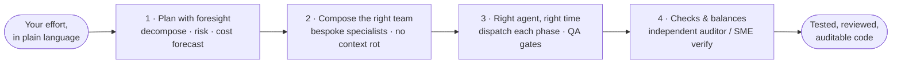

# The Four Pillars

Agent Baton is a **project manager for Claude Code**. Everything it does serves
four goals, in priority order. This page is the high-level map — what Baton is
*for* and how the parts fit together. Each pillar links to the deeper docs that
implement it.

## What an effort looks like

A task enters as plain language and leaves as tested, reviewed, auditable code.
Between those two points it passes through the four pillars in order.

Governance is **Pillar 4** — a trust mechanism that keeps the project management
honest — not the headline. The pillars are the goals; a deep toolkit (CLI, REST
API, memory, observability) supports them and the people who run Baton day to
day.

## Pillar 1 — Plan with foresight

Before a single token goes to an agent, Baton builds a complete picture of the
work: what kind of task it is, which phases it needs, which agents fit them,
where it is likely to break, and what it will cost. You commit to a plan, not a
hope. `baton plan --dry-run` previews the phases, the agent assigned to each
step, the gates that will block, and a cost forecast (with an explicit ±50%
band) — all before execution.

**Dive deeper:** [Orchestrator Usage](orchestrator-usage.md) ·
[Engine & Runtime](engine-and-runtime.md) ·
[State Machine](architecture/state-machine.md)

## Pillar 2 — Compose the right team

A single generalist agent on a complex codebase suffers **context rot** — by the
time it reaches step four it is carrying the weight of every earlier step plus
the whole codebase. Baton's answer is bespoke team composition: the
`talent-builder` creates narrowly-scoped specialists for *this* problem, so each
agent gets a clean context window focused on one domain. Routing then picks the
right stack-flavored variant for your project.

**Dive deeper:** [Agent Roster](agent-roster.md)

## Pillar 3 — Right agent, right problem, right time

A deterministic engine dispatches each specialist to its assigned phase, gates
the output before advancing, and recovers from crashes without losing state. The
PMO flow organizes the whole effort from spec to merged PR. You drive it through
the `baton execute` command group; the engine does the sequencing.

**Dive deeper:** [Engine & Runtime](engine-and-runtime.md) ·
[Storage, Sync, & PMO](storage-sync-and-pmo.md)

## Pillar 4 — Checks & balances

Governance serves the pillars above it: it makes sure the right agent was
actually *right*, not just fast or syntactically correct. Risk is classified
before the first agent fires; medium/high-risk work pulls in an independent
`auditor` (with veto authority) and, for regulated domains, a
`subject-matter-expert`. Policy hooks enforce guardrails on every tool call, and
verifiable evidence bundles make the outcome auditable.

**Dive deeper:** [Knowledge, Events, & Governance](governance-knowledge-and-events.md)

## The supporting layer

The pillars are the goals. Around them sits a deep toolkit that supports both the
work and the people who run Baton:

- **Reference for developers & contributors** — [CLI Reference](cli-reference.md),
  [API Reference](api-reference.md), [Agent Roster](agent-roster.md),
  [Terminology](terminology.md), [Invariants](invariants.md).
- **Memory, observability & learning** —
  [Observe, Learn, & Improve](observe-learn-and-improve.md),
  [Storage, Sync, & PMO](storage-sync-and-pmo.md).
- **Operations** — [Production Readiness](PRODUCTION_READINESS.md),
  [Troubleshooting](troubleshooting.md),
  [FinOps & Chargeback](finops-chargeback.md).

## How the docs map to the pillars

| Pillar | What it does | Dive deeper |
|--------|--------------|-------------|
| **1 · Plan with foresight** | Decompose, sequence, classify risk, forecast cost before execution | [orchestrator-usage](orchestrator-usage.md), [engine-and-runtime](engine-and-runtime.md), [state-machine](architecture/state-machine.md) |
| **2 · Compose the right team** | Create bespoke specialists; route to the right flavor | [agent-roster](agent-roster.md) |
| **3 · Right agent, right time** | Deterministic dispatch, gates, crash recovery, PMO flow | [engine-and-runtime](engine-and-runtime.md), [storage-sync-and-pmo](storage-sync-and-pmo.md) |
| **4 · Checks & balances** | Risk classification, auditor/SME verification, policy hooks, evidence | [governance-knowledge-and-events](governance-knowledge-and-events.md) |

For the full conceptual background, start with the
[Architecture Overview](architecture.md).
