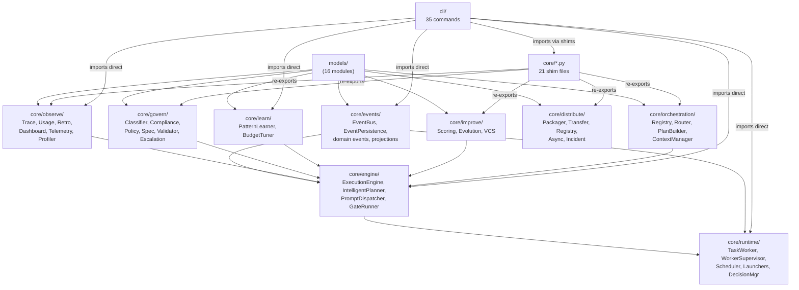
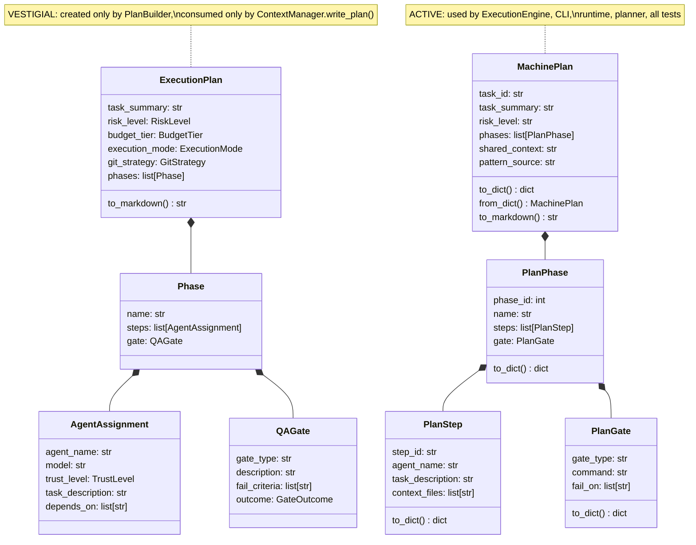
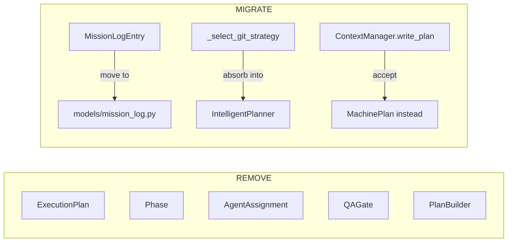
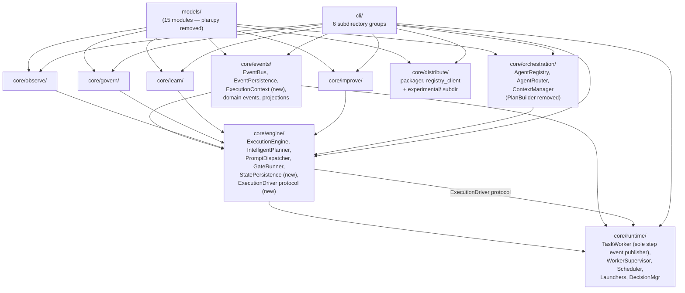
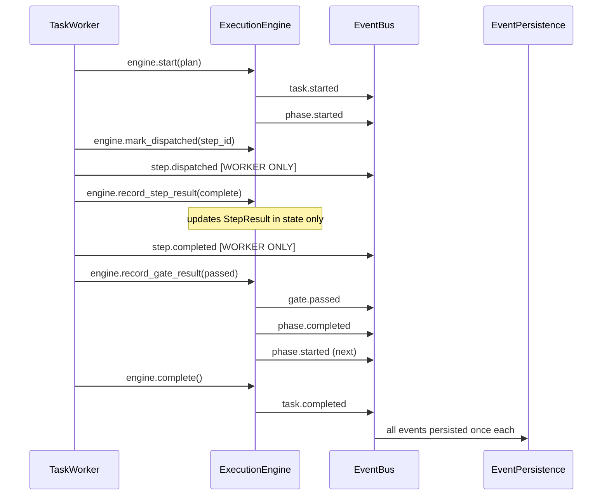
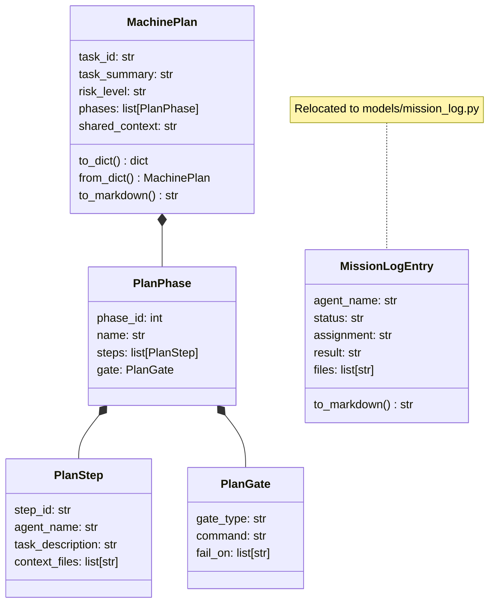

# Re-Architecture Human Design Document

**Status**: Draft for Review
**Date**: 2026-03-23
**Author**: Architecture Review Board
**Scope**: `agent_baton` Python package — internal structure only
**Risk to existing users**: Low. All proposals preserve the public API and CLI surface.

---

## 1. Executive Summary

The `agent_baton` package has grown organically through two distinct development phases. The first phase introduced a human-centric plan model (`ExecutionPlan`, `Phase`, `AgentAssignment`, `QAGate`, `PlanBuilder`) that was later superseded by a machine-readable equivalent (`MachinePlan`, `PlanPhase`, `PlanStep`, `PlanGate`, `IntelligentPlanner`) that the entire execution engine actually uses. The old model was never removed. Alongside this, a layer of 21 backward-compatibility shim files redirects imports from `core/*.py` to their canonical sub-package locations; all consumers are either CLI commands or test files, not internal library code. The ten proposals in this document address these and eight other structural issues at a range of priorities. Taken together, they eliminate approximately 27 files of dead code and indirection, establish a formal protocol between the async worker and the execution engine, resolve duplicate event publishing, and clarify the boundary between the execution core and peripheral subsystems — without changing observable behavior for end users.

---

## 2. Current Architecture

### 2.1 Package Layout

```
agent_baton/
  __init__.py            ← exposes 4 symbols: AgentRegistry, AgentRouter,
  │                         PlanBuilder, ContextManager
  models/                ← 16 modules. Foundation layer, no internal deps.
  │  plan.py             ← ExecutionPlan hierarchy (VESTIGIAL)
  │  execution.py        ← MachinePlan hierarchy (ACTIVE)
  │  enums.py
  │  events.py
  │  …
  utils/
  core/
  │  __init__.py         ← re-exports 48 symbols from all sub-packages
  │  registry.py    ┐
  │  router.py      │
  │  plan.py        │ 21 backward-compatibility shim files
  │  context.py     │ (single-line re-exports to canonical paths)
  │  usage.py       │
  │  … (16 more)    ┘
  │
  │  orchestration/      ← AgentRegistry, AgentRouter, PlanBuilder, ContextManager
  │  govern/             ← DataClassifier, ComplianceReportGenerator, PolicyEngine,
  │  │                     SpecValidator, AgentValidator, EscalationManager
  │  observe/            ← TraceRecorder, UsageLogger, RetrospectiveEngine,
  │  │                     DashboardGenerator, AgentTelemetry, ContextProfiler
  │  improve/            ← PerformanceScorer, PromptEvolutionEngine, AgentVersionControl
  │  learn/              ← PatternLearner, BudgetTuner
  │  distribute/         ← PackageBuilder, ProjectTransfer, RegistryClient,
  │  │                     AsyncDispatcher, IncidentManager (3 experimental)
  │  events/             ← EventBus, EventPersistence, domain events, projections
  │  engine/             ← ExecutionEngine, IntelligentPlanner, PromptDispatcher,
  │  │                     GateRunner
  │  runtime/            ← TaskWorker, WorkerSupervisor, StepScheduler,
  │                        AgentLauncher, ClaudeCodeLauncher, DecisionManager
  cli/
     main.py             ← auto-discovers commands in commands/
     commands/           ← 35 flat .py files
```

### 2.2 Dependency Graph (as-is)



### 2.3 Plan Model — Current State (Dual Hierarchy)



---

## 2b. Architectural Invariant: The Claude-Facing Interface

### The Interaction Chain

Agent-baton does not replace Claude Code — it serves it. The end user never
interacts with the Python package directly. The interaction chain is:

```
Human User ←→ Claude Code (natural language) ←→ baton CLI (structured) ←→ Python engine
             Layer A        Layer B                  Layer C                   Layer D
```

Claude reads the orchestrator agent definition (`.claude/agents/orchestrator.md`
or `agents/orchestrator.md`) as part of its system prompt, follows the `baton`
CLI commands documented there, and parses their stdout output to decide what
action to take next. Claude does not import Python — it reads text.

### Interface Boundary 1: CLI Command Surface (Claude → baton)

These commands are the control protocol between Claude and the engine:

| Command | Purpose |
|---------|---------|
| `baton plan "..." --save --explain` | Generate execution plan |
| `baton execute start` | Begin execution |
| `baton execute next` | Get next action |
| `baton execute record --step-id ... --agent ... --status ...` | Record step result |
| `baton execute gate --phase-id ... --result pass/fail` | Record gate result |
| `baton execute complete` | Finalize execution |
| `baton execute status` | Check current state |
| `baton execute resume` | Recover from crash |

**INVARIANT**: Every command string above must continue to work identically
after the re-architecture. Subcommand names are determined by `register()`
in each CLI module, not by file paths — so modules can move freely as long
as their registered names are unchanged.

### Interface Boundary 1b: CLI Output Format (baton → Claude)

The `_print_action()` function in `cli/commands/execute.py` (lines 68-101)
produces structured text that Claude parses to determine what to do:

```
ACTION: DISPATCH
  Agent: backend-engineer--python
  Model: sonnet
  Step:  1.1
  Message: ...
--- Delegation Prompt ---
...
--- End Prompt ---
```

**INVARIANT**: This output format is the most load-bearing piece of text in
the system. If `ACTION: DISPATCH` changes to `ACTION: dispatch`, or field
labels change, Claude will not recognize the action type. The `_print_action()`
function must be treated as a public API with a contract test.

### Interface Boundary 2: Execution State on Disk

The engine persists `execution-state.json` to `.claude/team-context/`. This
file is what makes `baton execute resume` work after a session crash.

**INVARIANT**: The path `.claude/team-context/execution-state.json`, its JSON
schema (`ExecutionState.to_dict()`/`from_dict()`), and `plan.json` must remain
stable. Any serialization format change means mid-session crashes cannot be
recovered.

### What This Means for the Re-Architecture

All 10 proposals are internal to Layer D (the Python engine). None changes a
CLI command name, output format, or disk schema. However, two proposals require
extra care:

- **P9 (Normalize Enums)**: Changes `ExecutionAction.action_type` from `str`
  to `ActionType` enum. The `to_dict()` serialization MUST continue outputting
  `.value` strings, or `_print_action()` breaks silently. A type guard
  assertion should be added to `_print_action()`.

- **P8 (Group CLI Commands)**: Changes the auto-discovery mechanism. If any
  command module fails to register, Claude will see "unknown subcommand" with
  no recovery path. A frozen set of expected subcommand names should be tested.

### Safeguards Required

1. **Before Phase 3**: Add a CLI output format regression test that asserts
   `_print_action()` produces exactly the text Claude expects for each
   `ActionType`.

2. **Before Phase 4**: Add a subcommand registration test with a frozen set
   of all 35 expected command names.

3. **After every phase gate**: Verify each `baton` command listed in
   `agents/orchestrator.md` runs without error (not covered by `pytest`).

4. **Document Boundary 1b**: Add a docstring to `_print_action()` stating
   this function is the control protocol between Claude and the engine.

---

## 3. Problems and Motivations

### 3.1 Parallel Plan Hierarchies Confuse Contributors

`models/plan.py` defines `ExecutionPlan`, `Phase`, `AgentAssignment`, and `QAGate`. `models/execution.py` defines `MachinePlan`, `PlanPhase`, `PlanStep`, and `PlanGate`. These are structurally similar but entirely separate class trees with no conversion layer between them. A new contributor reading `PlanBuilder` cannot tell from the code that the object it produces is never passed to the execution engine. The confusion is compounded by `IntelligentPlanner` importing `PlanBuilder` specifically to call its `_select_git_strategy()` static method — creating a dependency on a class whose primary model product it never uses.

The consumption footprint of `ExecutionPlan` is narrow: it is constructed in `PlanBuilder.create()` and its only consumer is `ContextManager.write_plan()`, which calls `plan.to_markdown()` and writes the result to disk. Meanwhile `MachinePlan` has its own `to_markdown()` implementation that produces equivalent output and is already used by all engine, runtime, and CLI code.

### 3.2 Twenty-One Shim Files Obscure the Real Package Structure

When the package was reorganized from a flat `core/*.py` layout to a structured sub-package layout, 21 single-line shim files were left at `core/*.py` to preserve import compatibility. Every CLI command and every test that predated the reorganization imports from the shim paths. Internal core code migrated to canonical paths immediately and never touches the shims.

The shims cost nothing at runtime, but they impose a cognitive tax: a reader browsing `agent_baton/core/` sees 22 files at the top level (21 shims + `__init__.py`) before encountering the actual sub-packages. The `core/__init__.py` re-exports 48 symbols, of which only 4 are consumed by `agent_baton/__init__.py`. Developers writing new code have two valid import paths for every class, with no signal indicating which one to prefer.

### 3.3 No Formal Contract Between Worker and Engine

`TaskWorker` is the async layer that drives real execution. It calls `ExecutionEngine` through seven distinct methods: `start`, `next_action`, `next_actions`, `mark_dispatched`, `record_step_result`, `record_gate_result`, `complete`, and `status`. This is the most critical contract in the system — it defines the interface between the async execution loop and the state machine — but it is defined nowhere. There is no Protocol class, no type annotation broader than the concrete `ExecutionEngine` class, and no way to pass a mock engine without subclassing or monkey-patching.

### 3.4 Duplicate Event Publishing Creates Silent Data Corruption

Both `ExecutionEngine.record_step_result()` and `TaskWorker._execution_loop()` publish `step.dispatched`, `step.completed`, and `step.failed` events to the same `EventBus`. An `EventPersistence` subscriber auto-wired in `ExecutionEngine.__init__` writes every event to a JSONL file. When a step completes, both the engine and the worker publish `step.completed` — the JSONL log receives two identical events per step. Projections built from this log (`project_task_view`) silently double-count step activity.

### 3.5 executor.py Is Too Large to Test in Isolation

At 878 lines, `executor.py` contains four distinct concerns in a single class:

| Concern | Approximate LOC | Location |
|---|---|---|
| State machine logic | ~400 | `_determine_action`, `_dispatch_action`, `_gate_passed_for_phase` |
| State persistence | ~150 | `_save_state`, `_load_state`, `_STATE_FILENAME` |
| Observability wiring | ~150 | `__init__` (tracer, usage logger, retro engine), `complete()` |
| Utilities | ~180 | `_build_delegation_prompt`, `_model_for_step`, `_agents_in_phase`, `_build_usage_record` |

Testing the state machine requires constructing a full engine with real filesystem paths, because persistence is not separable. A unit test for `_determine_action` must prepare `execution-state.json` on disk and hope the I/O layer cooperates.

### 3.6 Core vs Peripheral Layering Is Invisible

`core/engine/` and `core/runtime/` form the primary execution path — the code that runs when an orchestrated task is actually executing. `core/govern/`, `core/observe/`, `core/improve/`, `core/learn/`, and `core/distribute/` are peripheral subsystems that support observability, compliance, and evolution. These two categories sit at the same package level with no indication of their relative centrality. `agent_baton/__init__.py` exposes only `PlanBuilder` and `ContextManager` — not `ExecutionEngine` or `TaskWorker` — suggesting the package's own public API does not reflect what users actually need.

### 3.7 Three Experimental distribute Modules Are Not Gated

`core/distribute/incident.py`, `core/distribute/async_dispatch.py`, and `core/distribute/transfer.py` are scaffolding-level modules with thin implementations not exercised in production execution paths. They are co-located with the production `packager.py` and `registry_client.py`. Contributors cannot tell which distribute modules are production-ready without reading each file.

### 3.8 Thirty-Five Flat CLI Commands Are Hard to Navigate

`cli/commands/` contains 35 `.py` files with no grouping. Commands serving observability (`trace`, `dashboard`, `usage`, `telemetry`, `retro`, `context_profile`) share a flat directory with execution commands (`execute`, `plan_cmd`, `daemon`, `status`) and governance commands (`classify`, `compliance`, `policy`, `escalations`, `validate`, `spec_check`, `detect`). A contributor adding a new observability command must infer the correct conceptual category from the module's name alone.

### 3.9 Enum Values Stored as Strings Throughout the Execution Model

`ActionType`, `StepStatus`, and `PhaseStatus` in `models/execution.py` are declared as Python `Enum` classes, but `ExecutionAction.action_type` is typed as `str` and populated with `.value` strings (`ActionType.DISPATCH.value`). Comparisons throughout the engine and worker use the `.value` form. This is inconsistent with the rest of the models layer, where `models/enums.py` stores enum instances directly and only serializes to strings in `to_dict()` methods. The inconsistency causes subtle issues: IDE type-checkers cannot detect when a comparison uses the wrong `.value`, and extending the action type set requires remembering to use `.value` consistently.

### 3.10 EventBus Wiring Inside ExecutionEngine.__init__ Is Fragile

When an `EventBus` is passed to `ExecutionEngine.__init__`, the constructor silently auto-wires `EventPersistence` as a subscriber. This means the wiring behavior depends on constructor argument order, and constructing an engine with `bus=my_bus` without realising it implies persistence is non-obvious. It also means there is no way to construct an engine with a bus but without persistence (for testing). The pattern will silently lose events if the caller creates a persistence layer separately and then also passes a bus to the engine.

---

## 4. Proposals

### P1 — Remove Dual Plan Model Hierarchy (LOW)

**Problem recap**: `ExecutionPlan` and its companion classes (`Phase`, `AgentAssignment`, `QAGate`, `PlanBuilder`) are a vestigial layer from Epic 1. The execution engine has never used them. `MachinePlan` has its own `to_markdown()` method that renders identical content. The only remaining use of `ExecutionPlan` is `ContextManager.write_plan(plan: ExecutionPlan)`, which calls `plan.to_markdown()`.

**What to remove**:

| Item | Location | Lines |
|---|---|---|
| `ExecutionPlan` dataclass | `models/plan.py` | ~70 |
| `Phase` dataclass | `models/plan.py` | ~10 |
| `AgentAssignment` dataclass | `models/plan.py` | ~15 |
| `QAGate` dataclass | `models/plan.py` | ~15 |
| `PlanBuilder` class | `core/orchestration/plan.py` | ~135 |
| `RISK_SIGNALS` dict | `core/orchestration/plan.py` | ~20 |

**What to migrate**:

1. `ContextManager.write_plan()` changes signature from `plan: ExecutionPlan` to `plan: MachinePlan`. The method body remains identical — it calls `plan.to_markdown()`, which `MachinePlan` already implements.

2. `IntelligentPlanner._plan_builder.assess_risk()` and `_select_git_strategy()` are absorbed directly into `IntelligentPlanner` as private methods. Both are short (~20 lines) and already effectively used only by the planner. `assess_risk()` becomes `IntelligentPlanner._assess_risk()` (a method that already exists with equivalent logic at line ~280 of `planner.py`). `_select_git_strategy()` returns a `GitStrategy` enum (not a plain string); the sole callsite in `create_plan()` calls `.value` on the result. The absorbed version becomes a module-level private function returning `str` directly (inlining the `.value` call) to simplify the interface.

3. `MissionLogEntry` lives in `models/plan.py` but is conceptually unrelated to the plan model — it belongs to mission logging. Extract it to a new `models/mission_log.py`.

4. `models/plan.py` can then be deleted entirely.

**What remains**: `core/orchestration/plan.py` becomes empty; it is deleted. The `core/plan.py` shim (which re-exports `PlanBuilder`) is deleted as part of P2.

**Risk assessment**: Low. `ExecutionPlan` is not in the execution path. The only impact is on tests that import `PlanBuilder`, `ExecutionPlan`, `Phase`, `AgentAssignment`, or `QAGate` directly.



---

### P2 — Remove Backward-Compatibility Shim Layer (LOW)

**Problem recap**: 21 shim files at `agent_baton/core/*.py` each contain a single re-export statement. All consumers are CLI commands or tests. Internal core code uses canonical paths exclusively.

**Shim inventory**:

| Shim | Canonical path | CLI consumers | Test consumers |
|---|---|---|---|
| `core/registry.py` | `core/orchestration/registry.py` | `agents.py`, `route.py`, `detect.py` | `test_registry.py` |
| `core/router.py` | `core/orchestration/router.py` | `route.py`, `detect.py` | `test_router.py` |
| `core/plan.py` | `core/orchestration/plan.py` | — | `test_planner.py` (imports `PlanBuilder, RISK_SIGNALS` — both deleted by P1; this test must be rewritten to test `IntelligentPlanner` and the absorbed functions, or deleted) |
| `core/context.py` | `core/orchestration/context.py` | `status.py` | `test_context.py` |
| `core/usage.py` | `core/observe/usage.py` | `usage.py` | `test_usage.py` |
| `core/telemetry.py` | `core/observe/telemetry.py` | `telemetry.py` | `test_telemetry.py` |
| `core/retrospective.py` | `core/observe/retrospective.py` | `retro.py` | `test_retrospective.py` |
| `core/dashboard.py` | `core/observe/dashboard.py` | `dashboard.py` | `test_dashboard.py` |
| `core/classifier.py` | `core/govern/classifier.py` | `classify.py` | `test_classifier.py` |
| `core/compliance.py` | `core/govern/compliance.py` | `compliance.py` | `test_compliance.py` |
| `core/policy.py` | `core/govern/policy.py` | `policy.py` | `test_policy.py` |
| `core/escalation.py` | `core/govern/escalation.py` | `escalations.py` | `test_escalation.py` |
| `core/validator.py` | `core/govern/validator.py` | `validate.py` | `test_validator.py` |
| `core/spec_validator.py` | `core/govern/spec_validator.py` | `spec_check.py` | `test_spec_validator.py` |
| `core/scoring.py` | `core/improve/scoring.py` | `scores.py` | `test_scoring.py` |
| `core/evolution.py` | `core/improve/evolution.py` | `evolve.py` | `test_evolution.py` |
| `core/vcs.py` | `core/improve/vcs.py` | `changelog.py` | `test_vcs.py` |
| `core/sharing.py` | `core/distribute/packager.py` | `package.py` | `test_sharing.py` |
| `core/transfer.py` | `core/distribute/transfer.py` | `transfer.py` | `test_transfer.py` |
| `core/incident.py` | `core/distribute/incident.py` | `incident.py` | `test_incident.py` |
| `core/async_dispatch.py` | `core/distribute/async_dispatch.py` | `async_cmd.py` | `test_async_dispatch.py` |

**Migration steps**:

1. Update each CLI command file to import from the canonical path.
2. Update each test file to import from the canonical path.
3. Delete all 21 shim files.
4. Prune `core/__init__.py` from 48 exports to the 3 actually consumed by `agent_baton/__init__.py`: `AgentRegistry`, `AgentRouter`, `ContextManager` (`PlanBuilder` was already removed by P1).
5. Update `agent_baton/__init__.py` to import directly from canonical paths, not via `core/__init__.py`.

**Risk assessment**: Low. The migration is entirely mechanical find-and-replace. The runtime behavior of every CLI command and every test is unchanged — they call the same classes at the same canonical locations, just without the indirection layer.

---

### P3 — Formalize Worker-Engine Protocol (LOW)

**Problem recap**: `TaskWorker.__init__` accepts `engine: ExecutionEngine`. This is the most critical runtime contract in the system but it has no formal specification.

**Proposed interface**:

```python
# core/engine/protocols.py (new file, ~30 lines)
from typing import Protocol
from agent_baton.models.execution import ExecutionAction, MachinePlan

class ExecutionDriver(Protocol):
    def start(self, plan: MachinePlan) -> ExecutionAction: ...
    def next_action(self) -> ExecutionAction: ...
    def next_actions(self) -> list[ExecutionAction]: ...
    def mark_dispatched(self, step_id: str, agent_name: str) -> None: ...
    def record_step_result(self, step_id: str, agent_name: str,
                           status: str = "complete", **kwargs) -> None: ...
    def record_gate_result(self, phase_id: int, passed: bool,
                           output: str = "") -> None: ...
    def complete(self) -> str: ...
    def status(self) -> dict: ...
```

`TaskWorker.__init__` becomes `engine: ExecutionDriver`. `ExecutionEngine` already satisfies this protocol structurally — no changes to the engine are needed.

**Benefits**:
- Tests can inject a lightweight mock without subclassing `ExecutionEngine`.
- Alternative engine implementations (e.g. an in-memory engine for integration tests) are first-class.
- The contract is machine-checkable via `isinstance(engine, ExecutionDriver)` with `typing.runtime_checkable`.

**Risk assessment**: Very low. One new file, one type annotation change.

---

### P4 — De-duplicate Event Publishing (LOW)

**Problem recap**: Both `ExecutionEngine` and `TaskWorker` publish `step.dispatched`, `step.completed`, and `step.failed`. With `EventPersistence` auto-wired as a subscriber, each step transition produces two identical JSONL records.

**Ownership assignment**:

| Event topic | Correct owner | Rationale |
|---|---|---|
| `task.started` | Engine | State initialization |
| `phase.started` | Engine | Phase boundary is state-machine knowledge |
| `phase.completed` | Engine | Phase boundary is state-machine knowledge |
| `task.completed` | Engine | Terminal state |
| `gate.passed` | Engine | Gate result is recorded by the engine |
| `gate.failed` | Engine | Gate result is recorded by the engine |
| `step.dispatched` | Worker | The worker is the one dispatching |
| `step.completed` | Worker | The worker receives the launch result |
| `step.failed` | Worker | The worker receives the launch result |

**Changes to engine**: Remove the duplicate step-event publishes from `record_step_result()`. The `step.completed` and `step.failed` publishes are in the `if status == "complete"` / `elif status == "failed"` branches. The `step.dispatched` publish is triggered via `mark_dispatched()`, which calls `record_step_result(status="dispatched")` and hits the `elif status == "dispatched"` branch. All three are removed. The engine retains its internal `StepResult` state tracking -- the only change is that it stops broadcasting step-level events externally.

**Changes to worker**: No changes needed. The worker already publishes these three events correctly.

**Caveat**: Before removing engine-side publishing, verify that no production subscriber depends on receiving step events from the engine's bus instance when the engine and worker use different bus instances. In the current deployment topology (`WorkerSupervisor` wires both from the same bus), this is not an issue.

**Risk assessment**: Low, with one verification step.

---

### P5 — Split executor.py (LOW)

**Problem recap**: At 878 lines, `executor.py` mixes four distinct concerns. The state machine cannot be tested without real disk I/O because persistence is embedded in the same class.

**Proposed split**:

```
core/engine/
  executor.py       ← ExecutionEngine (state machine + observability wiring)
  persistence.py    ← StatePersistence (save/load/resume/recover)  [NEW]
```

**`StatePersistence` interface**:

```python
class StatePersistence:
    def __init__(self, root: Path, filename: str = "execution-state.json") -> None: ...
    def save(self, state: ExecutionState) -> Path: ...
    def load(self) -> ExecutionState | None: ...
```

`ExecutionEngine.__init__` accepts an optional `persistence: StatePersistence | None = None`. When `None`, it constructs a default instance from `self._root`. The engine delegates all state I/O through the persistence object.

**Test benefit**: A test for `_determine_action` can construct an engine with a mock `StatePersistence` that returns pre-built `ExecutionState` objects from memory. The state machine is tested independently of file I/O.

**Risk assessment**: Low. The public API of `ExecutionEngine` is unchanged. File layout changes are internal.

---

### P6 — Explicit Core vs Peripheral Layering (LOW)

**Problem recap**: The sub-package layout does not communicate which packages form the primary execution path and which are peripheral.

**Proposed changes**:

1. Update `agent_baton/__init__.py` to export the primary execution surface:

   ```python
   from agent_baton.core.engine.executor import ExecutionEngine
   from agent_baton.core.engine.planner import IntelligentPlanner
   from agent_baton.core.runtime.worker import TaskWorker
   from agent_baton.core.runtime.launcher import AgentLauncher, DryRunLauncher
   from agent_baton.core.orchestration.registry import AgentRegistry
   from agent_baton.core.orchestration.router import AgentRouter
   from agent_baton.core.orchestration.context import ContextManager
   from agent_baton.models.execution import MachinePlan
   ```

2. Add a module-level docstring to `core/__init__.py` documenting the dependency hierarchy:

   ```
   Dependency hierarchy (no circular imports):
     models  →  events, observe, govern  →  engine  →  runtime  →  CLI
   ```

3. No file moves, no renames.

**Risk assessment**: Very low. Documentation and export additions only.

---

### P7 — Gate Experimental distribute Modules (LOW)

**Problem recap**: Three modules in `core/distribute/` are scaffolding not exercised in production execution paths.

**Modules to gate**:

| Module | Status indicator |
|---|---|
| `core/distribute/incident.py` | Thin scaffolding; `baton incident` CLI uses the shim at `core/incident.py` |
| `core/distribute/async_dispatch.py` | Task dispatch scaffolding; `baton async` CLI uses the shim at `core/async_dispatch.py` |
| `core/distribute/transfer.py` | Cross-project transfer; fully functional but not part of standard execution |

**Proposed structure**:

```
core/distribute/
  __init__.py
  packager.py           ← production
  registry_client.py    ← production
  experimental/
    __init__.py
    incident.py
    async_dispatch.py
    transfer.py
```

After moving, update the three corresponding CLI command files to import from `core.distribute.experimental.*`, and update `core/__init__.py` and `core/distribute/__init__.py` exports accordingly.

**Risk assessment**: Very low. Three file moves, three import path updates in CLI commands and tests.

---

### P8 — Group CLI Commands (LOW)

**Problem recap**: 35 flat files in `cli/commands/` with no navigational structure.

**Proposed directory grouping**:

```
cli/commands/
  execution/     execute.py, plan_cmd.py, status.py, daemon.py,
                 async_cmd.py, decide.py
  observe/       dashboard.py, trace.py, usage.py, telemetry.py,
                 context_profile.py, retro.py
  govern/        classify.py, compliance.py, policy.py, escalations.py,
                 validate.py, spec_check.py, detect.py
  improve/       scores.py, evolve.py, patterns.py, budget.py, changelog.py
  distribute/    package.py, publish.py, pull.py, verify_package.py,
                 install.py, transfer.py
  agents/        agents.py, route.py, events.py, incident.py
```

**Discovery change**: `cli/main.py` currently uses `pkgutil.iter_modules(commands_pkg.__path__)` to discover command files. This must be extended to scan one level of subdirectories:

```python
for subdir in commands_pkg.__path__:
    for info in pkgutil.iter_modules([subdir]):
        # existing logic
    for group in Path(subdir).iterdir():
        if group.is_dir() and not group.name.startswith("_"):
            for info in pkgutil.iter_modules([str(group)]):
                # same logic
```

The registered subcommand names are determined by `sp.prog`, not the module filename, so existing subcommand strings (`baton execute`, `baton dashboard`, etc.) are preserved.

**Risk assessment**: Low. All command files move but their internal logic and registered subcommand names do not change.

---

### P9 — Normalize Enum Usage (MEDIUM)

**Problem recap**: `ActionType`, `StepStatus`, and `PhaseStatus` are declared as Enum classes in `models/execution.py` but their instances are immediately converted to `.value` strings at the definition site and throughout the codebase.

**Current pattern (inconsistent)**:

```python
# ExecutionAction stores action_type as str
action_type: str = ""  # ActionType value

# Comparison in executor.py
if action.action_type == ActionType.DISPATCH.value:
```

**Target pattern (consistent with models/enums.py)**:

```python
# ExecutionAction stores action_type as ActionType
action_type: ActionType = ActionType.DISPATCH

# Comparison in executor.py
if action.action_type == ActionType.DISPATCH:

# Serialization only at I/O boundary
def to_dict(self) -> dict:
    return {"action_type": self.action_type.value, ...}
```

**Migration scope**: All `action.action_type == ActionType.X.value` comparisons (approximately 12 sites in `executor.py`, `worker.py`, `cli/commands/execute.py`). `to_dict()` methods add `.value` calls only at the boundary. `StepResult.status` remains `str` in this proposal -- its `from_dict()` parses status as a plain string, and `ExecutionState.completed_step_ids` etc. filter by string comparison, making the migration wider than justified here.

**Risk assessment**: Medium. The change touches comparison sites in the hot path. Requires careful test coverage to confirm no comparison regression.

---

### P10 — EventBus Wiring Safety (LOW)

**Problem recap**: `ExecutionEngine.__init__` silently auto-wires `EventPersistence` when a bus is provided. This is surprising, non-optional, and difficult to test around.

**Proposed factory**:

```python
# core/runtime/context.py (new file, ~40 lines)
from dataclasses import dataclass
from pathlib import Path
from agent_baton.core.events.bus import EventBus
from agent_baton.core.events.persistence import EventPersistence

@dataclass
class ExecutionContext:
    bus: EventBus
    persistence: EventPersistence | None = None

    @classmethod
    def build(
        cls,
        events_dir: Path,
        *,
        persist: bool = True,
    ) -> "ExecutionContext":
        bus = EventBus()
        persistence = None
        if persist:
            persistence = EventPersistence(events_dir=events_dir)
            bus.subscribe("*", persistence.append)
        return cls(bus=bus, persistence=persistence)
```

`ExecutionEngine.__init__` gains an optional `context: ExecutionContext | None = None` parameter as an alternative to the bare `bus` parameter. When `context` is provided, the engine uses `context.bus` and skips internal auto-wiring.

Existing callers passing `bus=` directly continue to work unchanged (backward compatible). New callers use `ExecutionContext.build(events_dir=...)` for safe explicit wiring.

**Scope note**: `WorkerSupervisor` creates an `ExecutionEngine` in both `start()` (with bus wiring) and `status()` (without bus, for read-only state inspection). The `ExecutionContext` factory applies to `start()` only; `status()` constructs a bare engine for reading state and should remain unchanged.

**Risk assessment**: Very low. Additive only.

---

## 5. Target Architecture

### 5.1 Package Layout (after all proposals)

```
agent_baton/
  __init__.py         ← exports ExecutionEngine, TaskWorker, MachinePlan,
  │                      AgentRegistry, AgentRouter, ContextManager,
  │                      IntelligentPlanner, AgentLauncher, DryRunLauncher
  models/
  │  execution.py     ← MachinePlan hierarchy (unchanged)
  │  enums.py         ← ActionType now used as enum instance (P9)
  │  events.py
  │  mission_log.py   ← MissionLogEntry (extracted from plan.py by P1)
  │  …                ← plan.py DELETED
  utils/
  core/
  │  __init__.py      ← 3 exports only (trimmed by P2; PlanBuilder removed by P1)
  │
  │  orchestration/   ← AgentRegistry, AgentRouter, ContextManager
  │  │                   (PlanBuilder and plan.py DELETED by P1)
  │  govern/
  │  observe/
  │  improve/
  │  learn/
  │  distribute/
  │  │  packager.py
  │  │  registry_client.py
  │  │  experimental/    ← incident.py, async_dispatch.py, transfer.py (P7)
  │  events/
  │  │  bus.py
  │  │  persistence.py
  │  │  context.py       ← (domain events, unchanged)
  │  │  events.py
  │  │  projections.py
  │  engine/
  │  │  executor.py      ← ExecutionEngine (state machine, ~600 LOC after P5)
  │  │  persistence.py   ← StatePersistence (new, P5)
  │  │  planner.py       ← IntelligentPlanner (absorbs _select_git_strategy, P1)
  │  │  protocols.py     ← ExecutionDriver protocol (new, P3)
  │  │  dispatcher.py
  │  │  gates.py
  │  runtime/
  │     worker.py        ← TaskWorker (sole event publisher for step events, P4)
  │     supervisor.py
  │     context.py       ← ExecutionContext factory (new, P10)
  │     scheduler.py
  │     launcher.py
  │     claude_launcher.py
  │     decisions.py
  cli/
     main.py             ← updated discovery (P8)
     commands/
       execution/        ← 6 commands (P8)
       observe/          ← 6 commands (P8)
       govern/           ← 7 commands (P8)
       improve/          ← 5 commands (P8)
       distribute/       ← 6 commands (P8)
       agents/           ← 4 commands (P8)
```

### 5.2 Dependency Graph (after all proposals)



### 5.3 Event Ownership (after P4)



### 5.4 Execution Model After P1



---

## 6. Migration Strategy

The ten proposals have a dependency structure (see Section 2.2 and the Orchestration HDD for the full graph). The table below assigns them to three waves ordered by value-to-risk ratio, respecting those dependencies.

### Wave 1 — Foundation (Weeks 1–2)

| # | Proposal | Effort | Notes |
|---|---|---|---|
| P1 | Remove dual plan hierarchy | 2 days | Delete 5 classes + 1 module; migrate `ContextManager.write_plan`; extract `MissionLogEntry` |
| P3 | Formalize Worker-Engine Protocol | 0.5 day | New file + one annotation |
| P4 | De-duplicate event publishing | 0.5 day | Remove 3 publish calls from engine; verify subscriber topology |
| P5 | Split executor.py | 1 day | Extract `StatePersistence`; update engine to delegate |

Wave 1 unblocks test improvements immediately (P3 + P5), removes the most confusing element of the codebase (P1), and cleans event duplication (P4). P3, P4, and P5 are independent of each other and of P1; all four can run in parallel within this wave.

### Wave 2 — Shim Removal (Weeks 3–4)

| # | Proposal | Effort | Notes |
|---|---|---|---|
| P2 | Remove shim layer | 1.5 days | Mechanical find-and-replace; update 21 CLI + 22 test imports |

Wave 2 is deliberately a single proposal. P2 is the highest-volume mechanical change and the dependency blocker for everything in Waves 3 and 4. Isolating it simplifies review and rollback.

### Wave 3 — Structure (Weeks 4–5)

| # | Proposal | Effort | Notes |
|---|---|---|---|
| P6 | Explicit layering | 0.5 day | Export additions + docstring |
| P7 | Gate experimental modules | 0.5 day | 3 file moves + import updates |
| P9 | Normalize enum usage | 1.5 days | ~12 comparison sites + serialization boundaries |
| P10 | EventBus wiring safety | 0.5 day | New `ExecutionContext` factory |

P6, P7, P9, and P10 can run in parallel. P9 is the highest-risk proposal in the project; consider deferring it until a test coverage pass confirms all comparison sites are covered.

### Wave 4 — CLI Polish (Week 6)

| # | Proposal | Effort | Notes |
|---|---|---|---|
| P8 | Group CLI commands | 1 day | 35 file moves + discovery update |

P8 is deliberately last: it requires canonical imports (P2) and gated experimental modules (P7) in place. It is the only wave with user-visible impact (`baton --help` groups may reorganize).

### Migration Guardrails

The following gates apply to every wave:

1. **Green before merge**: All 1,977 tests pass before merging any wave branch.
2. **No API surface changes**: `agent_baton/__init__.py` exports must be a superset of the current 4 exports throughout the migration. No existing import path used by downstream users (`from agent_baton import AgentRegistry`) may break.
3. **CLI subcommand strings unchanged**: All `baton <subcommand>` strings registered in `sp.prog` must remain identical through P8.
4. **Feature branch per wave**: Commit history should allow `git bisect` to identify any regression.

---

## 7. Success Criteria

### Quantitative

| Metric | Current | Target |
|---|---|---|
| Shim files (`agent_baton/core/*.py`) | 21 | 0 |
| `core/__init__.py` export count | 48 | 3 |
| `models/plan.py` classes | 5 | 0 (file deleted) |
| `executor.py` LOC | 878 | < 550 |
| Event emissions per completed step | 2 (engine + worker) | 1 (worker only) |
| CLI command files discoverable via canonical paths | ~50% | 100% |
| Protocol classes for critical contracts | 0 | 1 (ExecutionDriver) |

### Qualitative

- A contributor browsing `agent_baton/core/` sees sub-packages immediately; no shim files in the listing.
- `models/execution.py` is the only file a new contributor needs to understand the plan and execution models. `models/plan.py` does not exist.
- A unit test for `ExecutionEngine._determine_action()` can pass a pre-built `ExecutionState` without writing any files to disk.
- The JSONL event log for a three-step, one-gate task contains exactly 8 events: `task.started`, `phase.started`, `step.dispatched` x3, `step.completed` x3, `gate.passed`, `phase.completed`, `phase.started` (phase 2), `task.completed`. No duplicates.
- `TaskWorker` accepts any object satisfying `ExecutionDriver` — a dry-run mock can be injected without subclassing the production engine.

---

## 8. Open Questions

**OQ-1: PlanBuilder public API — is it used by external callers?**
`PlanBuilder` is exported from `agent_baton/__init__.py` and `agent_baton/__init__.py.__all__`. If any downstream project constructs plans using `PlanBuilder`, P1 breaks them. Determine whether PlanBuilder is used outside this repository before executing P1. If it is, publish a deprecation notice before removal.

**OQ-2: P9 test coverage gap**
The enum normalization (P9) touches comparison sites in `executor.py` and `worker.py`. Before proceeding, confirm that the existing 1,977 tests exercise every comparison branch. If coverage is partial, write targeted tests first.

**OQ-3: P4 subscriber topology in production**
The duplicate event publishing problem (P4) is confirmed for the `WorkerSupervisor` deployment path, where engine and worker share a bus. If any external integration constructs an `ExecutionEngine` with a bus and does not use `TaskWorker`, removing engine-side step event publishing breaks that integration. Audit all known callsites before removing.

**OQ-4: P8 CLI command discovery edge cases**
The current `pkgutil.iter_modules` discovery in `cli/main.py` relies on `commands_pkg.__path__`. When subdirectories are introduced (P8), the discovery logic must be extended. Verify that the extended discovery correctly handles packages installed in editable mode (`pip install -e`) and in site-packages.

**OQ-5: MissionLogEntry consumers (P1 extraction)**
`MissionLogEntry` is imported by `ContextManager` via `from agent_baton.models.plan import ...`. After P1 moves it to `models/mission_log.py`, update all import sites. Confirm there are no external users importing `MissionLogEntry` from `agent_baton.models.plan` before deleting.

**OQ-6: Sequencing P1 and P2**
P1 deletes `core/orchestration/plan.py` (the canonical location that `core/plan.py` shims to). P2 deletes `core/plan.py` (the shim). If P2 executes before P1, the shim is removed before its target. If P1 executes first, the shim points to a deleted module until P2 runs. The safest sequence is P1 and P2 in the same branch, or P1 first with P2 immediately following.

---

## Appendix: Consolidation Notes

The following changes were applied during cross-document consolidation review
(2026-03-23) to bring the HDD, TDD, Orchestration HDD, and Orchestration Plan
into alignment.

### Changes to this document (HDD)

| Section | Change | Reason |
|---------|--------|--------|
| P1 heading | `(HIGH)` changed to `(LOW)` | Body text and all other documents say Low; heading was wrong |
| P1 migration item 2 | Added detail about `_select_git_strategy` returning `GitStrategy` enum, not `str` | TDD correction backport: the original PlanBuilder method returns a `GitStrategy` enum; the callsite does `.value` |
| P2 heading | `(MEDIUM)` changed to `(LOW)` | Body text says Low; TDD and orchestration docs agree |
| P2 shim inventory | Added note to `core/plan.py` row about `test_planner.py` importing `PlanBuilder, RISK_SIGNALS` | TDD correction backport: this test needs rewrite, not just import migration |
| P2 migration step 4 | Changed "4 exports" to "3 exports"; removed `PlanBuilder` from list | P1 removes PlanBuilder before P2 runs; TDD says 3 exports |
| P3 heading | `(MEDIUM)` changed to `(LOW)` | Body text says "Very low"; TDD agrees |
| P3 code block | `protocol.py` changed to `protocols.py` | TDD uses `protocols.py` (plural) throughout |
| P4 heading | `(MEDIUM)` changed to `(LOW)` | Body text says "Low, with one verification step" |
| P4 engine changes | Rewrote to describe the precise `elif status == "dispatched"` block and `mark_dispatched()` path | TDD correction backport: the dispatched-event duplicate is via `record_step_result(status="dispatched")`, not a separate publish call |
| P5 heading | `(MEDIUM)` changed to `(LOW)` | Body text says Low |
| P9 heading | `(LOW)` changed to `(MEDIUM)` | Body text says Medium; all other documents agree |
| P9 migration scope | Added note that `StepResult.status` remains `str` | TDD made deliberate decision to defer StepResult migration due to `from_dict` and property filter complexity |
| P10 code block | `core/events/context.py` changed to `core/runtime/context.py` | TDD places ExecutionContext in runtime (not events), which is correct since the factory constructs engine+bus+launcher |
| P10 scope note | Added note about `WorkerSupervisor.status()` constructing bare engine | TDD correction backport: `status()` should remain unchanged (read-only, no bus) |
| Section 5.1 target layout | Fixed `protocol.py` to `protocols.py`; moved `ExecutionContext` from `events/` to `runtime/` | Align with TDD |
| Section 6 migration strategy | Restructured waves from 3 to 4; aligned with orchestration phase groupings | Original 3-wave grouping put P4 in Wave 2 (wrong: no dependency on P1/P2) and P6 in Wave 2 (wrong: depends on P2 in a separate wave) |
| Section 7 quantitative targets | Changed `core/__init__.py` target from 4 to 3 | PlanBuilder removed by P1, only 3 remaining |
| Section 6 intro sentence | Removed claim that proposals are "independent" | The document itself demonstrates they have dependencies |

### Changes to the Orchestration HDD

| Section | Change | Reason |
|---------|--------|--------|
| Phase 1 gate | `EngineProtocol` changed to `ExecutionDriver` | TDD names the protocol `ExecutionDriver` |
| All gate commands | Updated from `pytest --tb=short -q` to match orchestration plan's precise commands (with `-x` flag, import checks, CLI checks) | Orchestration plan had more precise gates |
| All branch names | `refactor/phase-N-*` changed to `rearch/phase-N` | Align with orchestration plan's git strategy |
| All commit prefixes | `refactor(P#)` changed to `rearch(P#)` | Same |
| P10 description | Added `ExecutionContext` factory mechanism | Was missing; HDD and TDD both specify this factory |
| Appendix table | Fixed file counts and primary files for P2-P10 | Aligned with TDD-verified codebase facts: 21 shim files (not 20), `protocols.py` for P3, `persistence.py` for P5, `runtime/context.py` for P10 |

### Changes to the Orchestration Plan (machine-readable)

| Section | Change | Reason |
|---------|--------|--------|
| Metadata | Corrected test count from 1730 to 1977; corrected CLI count from 31 to 35; corrected `runtime/` and `events/` to EXISTS | Plan was drafted in a stale worktree behind master |
| Step 1.3 | Added `recover_dispatched_steps() -> int` to protocol method list | TDD P3 includes this method |
| Step 1.4 | Replaced entirely: was "Audit" with incorrect claim that EventBus does not exist; now correctly describes de-duplication targeting executor.py event publishes | Master has `core/events/` and `core/runtime/`; the original step was written for a stale worktree |
| Step 1.6 | Changed test count from 1730 to 1977 | Master count |
| Step 2.1 | Changed command file count from 31 to 35 | Master count |
| Step 3.3 | Removed claim `worker.py` does not exist; added correct note about 5 ActionType comparisons in worker.py; added worker.py to context_files and allowed_paths; changed StepResult.status scope to match TDD decision (remains `str`) | Master has `core/runtime/worker.py` |
| Step 3.4 | Renamed from "Normalize ContextManager" to "Verify ContextManager"; added Step 3.4b for P10 (EventBus Wiring Safety) | P10 was missing from the orchestration plan entirely because the original step was repurposed when `runtime/` was absent |
| Phase 3 header | Updated parallel/dependency list to include Step 3.4b | New step added |
| Step 3.5 | Updated depends_on to include 3.4b | New dependency |
| Step 4.1 | Updated command count to 35; updated file assignments to include daemon.py, decide.py, events.py; changed from 7 groups to 6 | Master has 35 commands; group count matches TDD |
| Dependency graph | Added 3.4b node | New step |

### No changes to the TDD

The TDD was verified against actual codebase source and served as the ground-truth
reference for corrections to the other three documents.
